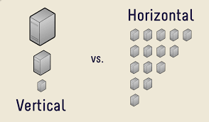
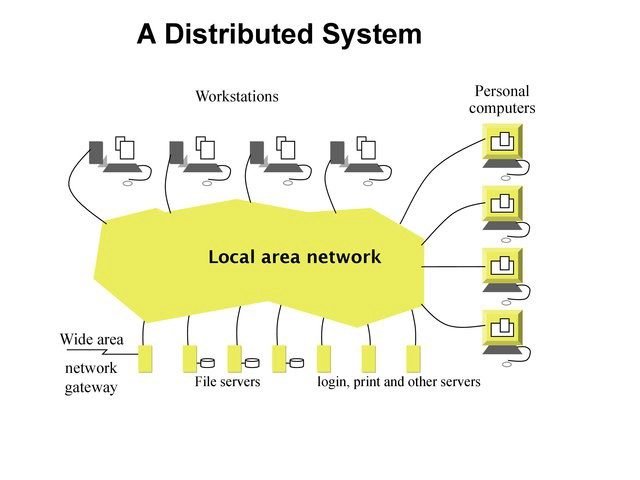
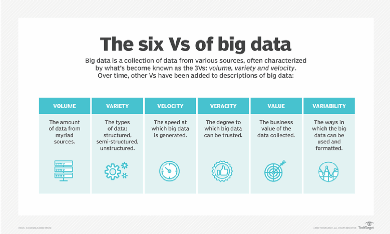
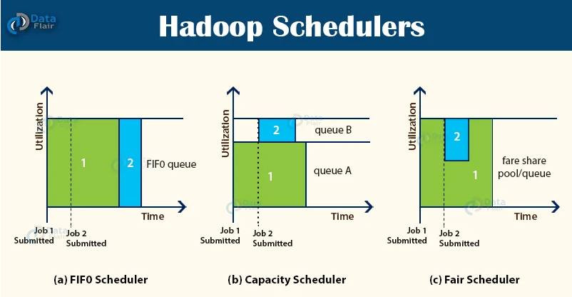
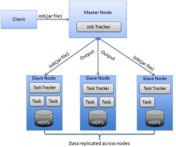
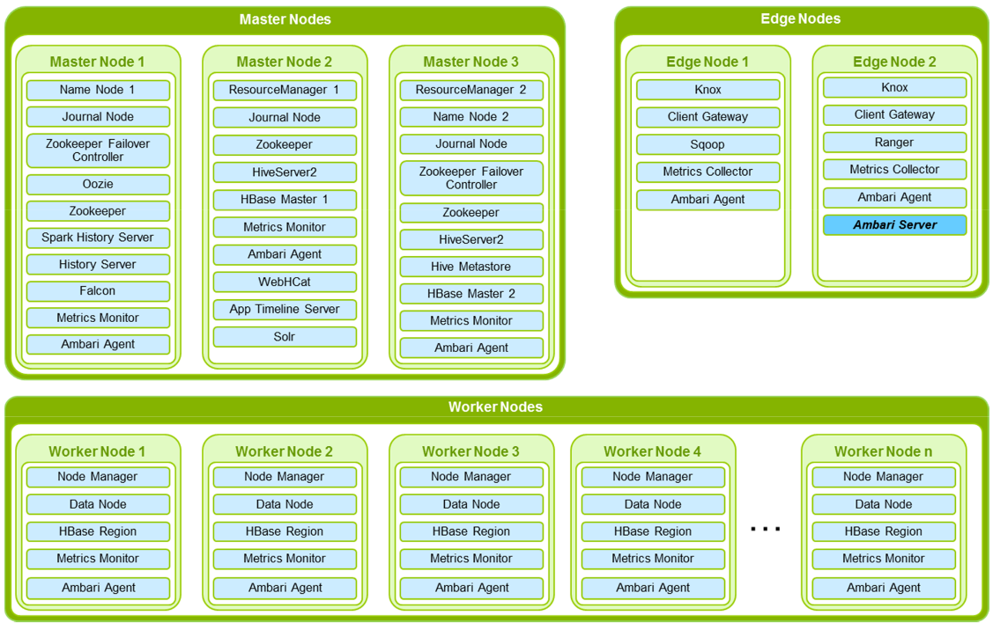

# Recapitulation of big data class

## What is big data

Data, and the insight it offers, is essential for business to innovate and differentiate. Coming from a variety of sources, from inside the firewall out to the edge, the growth of data in terms of volume, variety and speed leads to innovative approaches. Today, Data Lakes allow organizations to accumulate huge reservoirs of information for future analysis. At the same time, the Cloud provides easy access to technologies to those who do not have the necessary infrastructure and Artificial Intelligence promises to proactively simplify management.

With Big Data technologies, Business Intelligence is entering a new era. Hadoop and the likes, NoSQL databases, and Cloud managed infrastrutures store and represent structured and unstructured data and time series such as logs and sensors. From collect to visualization, the whole processing chain is processed in batch and real time.

### What is an Information System (IS)?

- Collect data
- Process it
- Store it
- Distribute it

### Basic knowledge: Distributed systems

A distributed system is a group of computers that appear as a unique and coherent system to the end user.

### Basic knowledge: Horizontal vs vertical scaling

- Vertical scaling: increase the size of the servers = more RAM, more powerful CPUs, more disk space, etc.
- Horizontal scaling: increase the number of server instead of their size. Works for distributed systems.

### Distributed systems

A distributed system is a group of computers that appear as a unique and coherent system to the end user.

Advantages:

- Scalability
- Availability
- Flexibility

Disadvantages:

- Harder to architecture
- Harder to use
- Harder to maintain

## Big Data: The 6 Vs

[Reference](https://searchdatamanagement.techtarget.com/definition/big-data)

## The Hadoop Ecosystem

- A stack of **Open Source softwares** offering all the functionalities needed to build a [Data Lake](https://en.wikipedia.org/wiki/Data_lake) and exploit the data stored in it. Most of the Hadoop projects are maintained by the [Apache Software Foundation](https://apache/org) and can be found on [their GitHub](https://github.com/apache).
- Nearly all are built using **Java** or at least run in the **JVM** (Java Virtual Machine)
- Preferred execution environment: **Linux**

### Hadoop ecosystem projects

- Distributed Filesystem: HDFS
- Resource Manager: YARN
- Execution Engines: MapReduce, Tez, Spark
- Warehouse / SQL: Hive
- NoSQL DB: HBase
- And other stuff

### Apache Hadoop core

- **HDFS:** Hadoop Distributed File System
- **YARN:** Yet Another Resource Negotiator
- **MapReduce:** Big Data applications framework

### What is HDFS?

The **Hadoop Distributed File System**:

- Data stored on **hundred/thousands of nodes**
- Data is **replicated**:
  - Avoid data loss
  - Optimize access
- Support **huge files**: typical size from GB to TB
- Focus on **high throughput** vs low latency
- **Unix-like** file system (tree + rwx permissions)

### Master / Worker architecture

- Master component coordinates workers
- Worker components do the job (compute)

### HDFS: Architecture

- **NameNode** (= master): Handles file system metadata. For each file, it knows:

  - The blocks that compose the file
  - The position of each block in the cluster

- **DataNodes** (= workers):

  - Store the blocks on disks (hardware optimization)
  - Handle read/write operations

- **Secondary NameNode**: Builds HDFS checkpoints (= FSImage) from NameNode edit logs

  - Enables faster start-up of the NameNode in case of restart
  - Only a helper node, it is not compulsory

### HDFS: Data replication example

### HDFS: Client interactions

### HDFS: Important properties

- **WORM** = Write Once Read Many: no update on files
- **Rack awareness**
- NameNode stores all the metadata in RAM => **small files problem**

### HDFS: Sum up

Components:

- **NameNode**: tracks blocks/files in the cluster
- **DataNode**: stores blocks + handles read/write operations
- **Secondary NameNode**: builds checkpoints (FSImage) based on edit logs

What is wrong with this architecture? => **SPOF (Single Point of Failure)**

### High Availability

High Availability: more than 1 master (1 **active** + N **standby**)

- Avoid **split-brain problem**: consensus via **ZooKeeper** (quorum)
- Avoid Secondary NameNode SPOF via shared edits = **JournalNodes**

### HDFS: High Availability mode

### What is YARN?

Yet Another Resource Negotiator:

- Cluster resource manager:

- - Handles the **RAM** and the **CPU** of workers
  - Allocates resources to applications

- Job monitoring

### YARN: Architecture

- **ResourceManager** (= master):

  - Schedules applications based on available resources
  - Allocating resources to the applications

- **NodeManager** (= worker): Handle resources on one worker

### YARN: Applications

Application = single job or DAG of jobs

Components (JVMs) of an application:

- **ApplicationMaster**: 

  - First container of each application to be allocated (by ResourceManager)
  - Runs on one of the workers
  - It requests resources for other containers
  - It monitors the process

- **Containers**: They do the computing

### YARN: Application lifecycle

### YARN: Job scheduling

- **FIFO scheduler**:
  - first comes first served basis
  - long jobs will occupy all the resources  
- **Capacity scheduler**:
  - two queues: one for longer and one for shorter jobs
  - if only one queue is occupied, the resources are not fully exploited
- **Fair scheduler**:
  - resources are dynamically allocated 

### Resources

- [HDFS Architecture](https://hadoop.apache.org/docs/r3.1.0/hadoop-project-dist/hadoop-hdfs/HdfsDesign.html)
- [Secondary NameNode - What it really do?](http://blog.madhukaraphatak.com/secondary-namenode---what-it-really-do/)
- [YARN scheduling](https://data-flair.training/blogs/hadoop-schedulers/)

### Hadoop cluster topology

Hadoop high-level architecture

Location of components and subcomponents:

- **Masters**: NN, RM, HBaseMaster
Supposed to host master services of the components which have the master/slave architecture:
    - low level of computation
    - low amount of storage
    - high level of security/criticity

- **Utility**: HiveMetastore, HiveServer2, Oozie*, Ambari**:
    - hosts services that enrich the functionalities of the cluster, these services usually act like a client to Hadoop(HDFS/Yarn), however they still have a master role for end-users.

- **Workers**: DN, NM, RS:
    - for computation
    - for storage
    - high level of security

- **Edge nodes**: HiveServer2, Zeppelin, clients (hdfs, yarn, beeline, hbase, spark):
  - Interface between the end-user and the cluster
  - storage for potential user environment

* Oozie: Apache Oozie is a server-based workflow scheduling system to manage Hadoop jobs

** Ambari: Apache Ambari is an open-source administration tool deployed on top of Hadoop clusters

Node hardware specifications:

- **Masters**: medium RAM/CPU
- **Utility**: medium RAM/CPU
- **Workers**: lot of RAM/CPU, lots of disks (> 10)
- **Edge nodes**: can be VMs/containers
