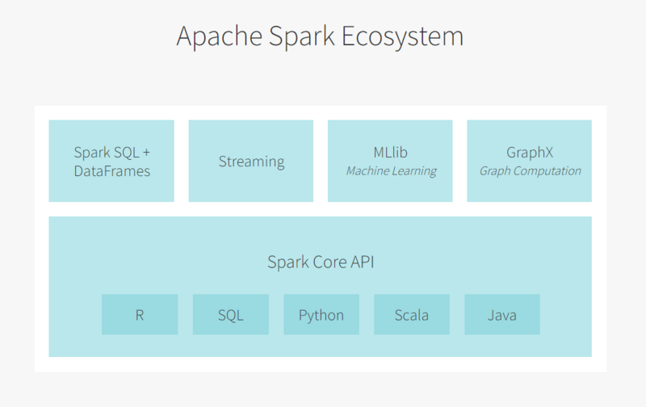
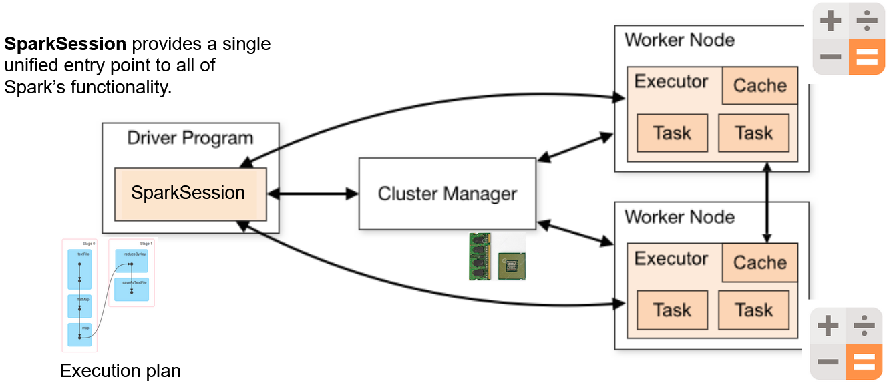
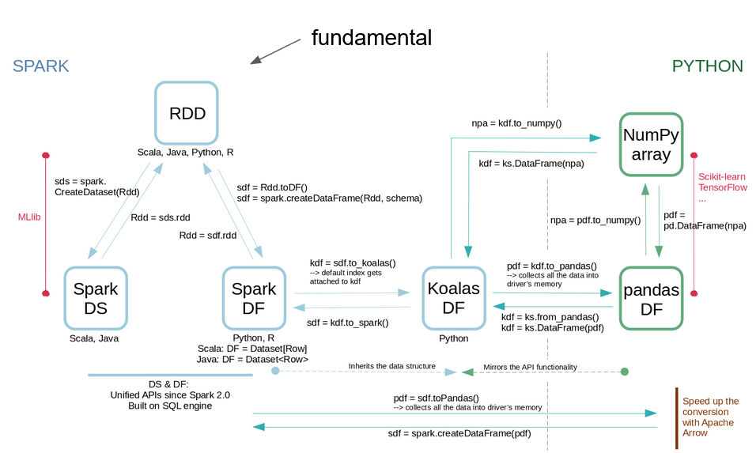
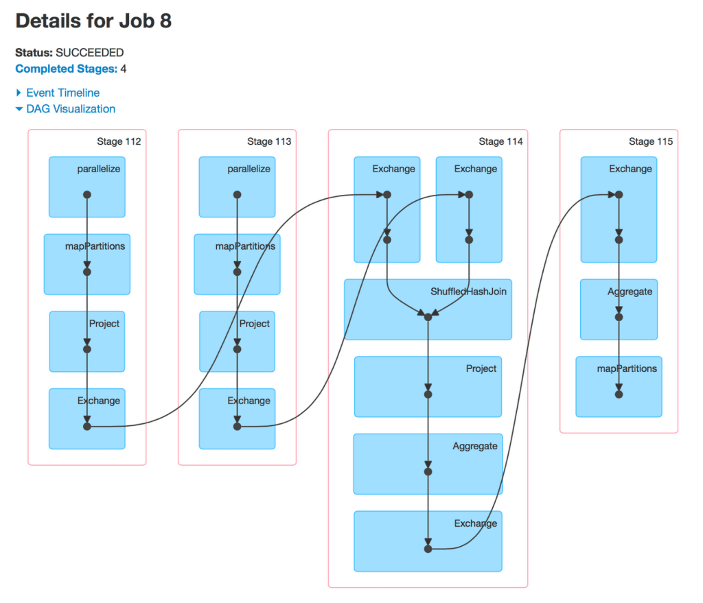
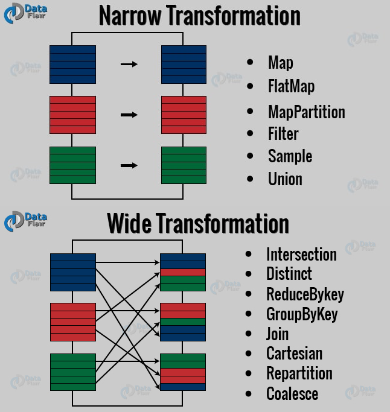
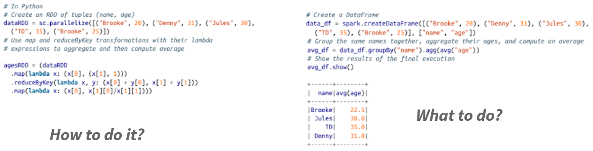
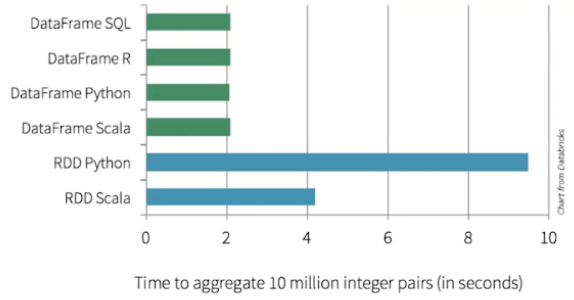
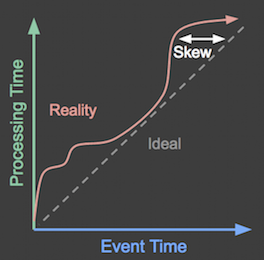
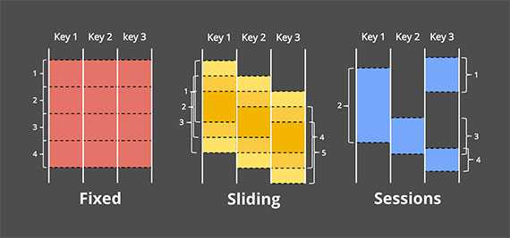

# Introduction to Spark & RDDs

## What is Apache Spark?

- Fast (in-memory), distributed (parallel), general-purpose **cluster computing system** -   [spark.apache.org](https://spark.apache.org/docs/latest/index.html)
- **Open Source** project ([Apache Software Foundation](http://www.apache.org/))
- Strongly tied to the **Hadoop** ecosystem
- Written in **Scala** → runs in the JVM (Java Virtual Machine)
- Pick your language: **Scala, Python, R, SQL, Java**
- Sparks transforms your code into **tasks** to run on the **cluster nodes**

## Use cases

- Analyze / transform / apply ML models on:
  - Very **large datasets** (Extract, Transform and Load)
  - **Streaming** data (in near-real-time)
  - **Graphs** (network analysis)
- of structured (tables), semi-structured (JSON) or unstructured (text) data

## Spark ecosystem



## Internals

Spark connects to cluster managers that **distribute resources** (RAM, CPU) to applications, running on a cluster:

- Hadoop **YARN**
- Apache Mesos
- Kubernetes
- Spark standalone

When you write the code and submit it, Spark:

1. Asks for resources to **create driver + executors**
2. Transforms the **code** into **tasks**
3. **Driver** sends **tasks** to **executors**
4. **Executors** sends **results** to **driver**



## Data structures



## Operations

2 types of **operations**:

- **Transformations**:
  - transform a Spark DataFrame/RDD into a new DataFrame/RDD without altering the original data
  - examples: orderBy(), groupBy(), filter(), select(), join())
- **Actions**:  
  - get the result
  - examples: show(), take(), count(), collect(), save())

**Lazy evaluation**: transformations triggered when action is called.

## RDDs: Resilient Distributed Datasets

### Properties

- A **fault-tolerant collection** of elements partitioned **across the nodes** of the cluster (parallelism)
- An element can be: string, array, dictionary, etc.
- An RDD is **immutable**
- Transformations: lambda expressions on  **key-value pairs**
- An RDD can be **persisted** in memory for reuse (avoid recomputing)
- Mostly load data from **HDFS** (or Hadoop-like file system)
- RDDs are **partitioned**:
  - **1 partition** = **1 block** = 128 MB in HDFS
  - **1 task** runs on **1 partition**
  - Default = 1 partition per CPU core

### API

Chain transformations and use the result with an action :

```Python
rdd = sc.wholeTextFiles('hdfs://text/file/path') \
        .map(lambda x: x.split(',')) \      #transformation
        .flatMap(...) \                     #transformation
        .groupByKey(...)                    #transformation

rdd.take(10)      # action
```

When an action is run:

- Spark builds a **Directed Acyclic Graph (DAG)** of stages
- 1 **stage** = X **tasks** (1 by RDD partition)
- Tasks are sent to **executors**
- The end of one stage is conditioned by a **shuffle**



### Narrow and wide transformations



# SparkSQL & DataFrames

## RDDs: Pros and Cons

- Pros
    - Developers: **low level control** of execution
- Cons
  - For user
      - **complicated** to express complex ideas
      - **difficult** to understand the code
  - For Spark: lambda functions are **opaque** (no optimization)

## DataFrames

- Structured dataset:
  - In-memory, distributed tables
  - Named and typed columns: schema
  - Collection of **Row**s
- Sources available: structured files, Hive tables, RDBMS (MySQL, PostgreSQL, …), RDDs
- High-level APIs

## RDDs vs DataFrames: code



## RDDs vs DataFrames: performance



### Catalyst optimizer


## Working with DataFrames

Querying DataFrames:
- By **chaining** functions

```python
df
  .select(...)
  .filter(...)
```

- By writing **SQL strings**

```python
spark.sql("SELECT * FROM table")
```

## Stream processing

### What is Streaming?

1. **Unbounded data sets** (in opposition to finite data sets);
2. **Unbounded data processing** (in time);
3. **Low-latency**, approximate and/or speculative results.

### Stream processing problematic

- **Event time** vs **processing time**



**Windows:**

- Needed for aggregations
- Processing or event time?



- **Watermark** = given an event time E to a processing time P, we state that _at time P, all data generated prior to E have been observed_

- **Trigger** = time when the output are materialized

### Difference between Spark Streaming and Spark Structured Streaming

- Spark Streaming was developped first and was initially used for RDDs.
- Spark Streaming is nolonger maintained.
- Spark Structured Streaming was designed for dataframes and is integrated with spark sql library.
- Spark Structured Streaming is therefore easier to use with dataframes.
