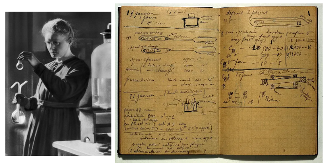
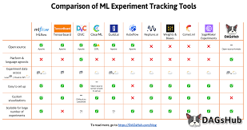

# Experiment tracking

## Motivation

Experimentation requires bookkeeping.

- To know what was done
- How it was done
- What else there is to be done

## What is experiment tracking?

- During model development, we test many different things:
  - Algorithms
  - Parameters
  - Datasets (split, sampling…)
  - Features (engineering, selection)

- In long term, we would like to memorize **what** we tested and **how**
- In short term, we would like to **compare results** (easily) to keep the best model

- To be able to compare different models, we need to track (record):
  - Statistical **metrics**
  - Business metrics
  - Other **artifacts** (plots)
  - The **dataset**
- To reproduce the training/execution, we need to track the **environment** (libraries, versions)

Tools:

- Many tools available and they mostly offer end-to-end ML lifecycle management.
- We will use **MLflow**.

## What is MLflow?

MLflow is an open source platform to manage the ML lifecycle, including experimentation, reproducibility, deployment, and a central model registry. MLflow currently offers four components:

- We will focus on **experiment tracking**.
- We will be using **managed version** on Databricks.

[MLflow official site](https://www.mlflow.org/)

## MLflow basic concepts

MLflow Tracking is organized around the concept of **runs**, which are executions of some piece of data science code. Each run records the following information:

- **Code Version**: Git commit hash used for the run, if it was run from an MLflow Project.
- **Start & End Time**: Start and end time of the run.
- **Source**: Name of the file to launch the run, or the project name and entry point for the run if run from an MLflow Project.
- **Parameters**: Key-value input parameters of your choice. Both keys and values are strings.
- **Metrics**: Key-value metrics, where the value is numeric. Each metric can be updated throughout the course of the run (for example, to track how your model’s loss function is converging), and MLflow records and lets you visualize the metric’s full history.
- **Artifacts**: Output files in any format. For example, you can record images (for example, PNGs), models (for example, a pickled scikit-learn model), and data files (for example, a Parquet file) as artifacts.

It can be easily integrated in already existing code.

[Reference](https://www.mlflow.org/docs/latest/tracking.html)

## Practical example

