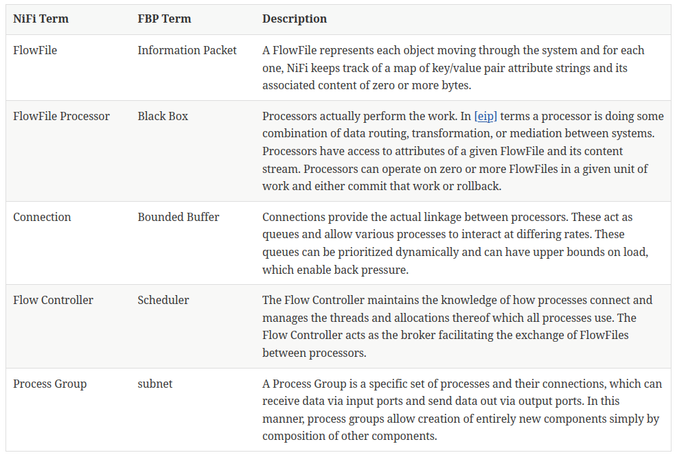

# Flow-based-programming (FBP)

- discovered back in the late 1960s
- FBP is a particular form of dataflow programming:
    - Data flows through nodes
    - It follows a Directed Acyclic Graph (DAG)
- FBP DAG has the following specificities:
    - The nodes on the graph are called Processes or Black Box
    - Edges are called Connections
    - Messages are called information packets (IPs)

## Where is it applicable

Flow-based programming applies most naturally to domains which already have the notion of components, black boxes, processes, pipelines, etc. In particular, FBP is very attractive in:

- Bioinformatics
- Data engineering, e.g. ETL
- DevOps
- IoT
- Low-code systems
- Machine Learning

## Apache Nifi

- Created by The NSA and was handed to the Apache foundation in 2015
- Runs in a Java Virtual Machine (JVM)

### Use cases and functionalities of Apache NiFi:

- Data Ingestion: NiFi is widely used for ingesting data from various sources into data lakes, data warehouses, or other storage systems.

- Data Transformation and Routing: NiFi enables users to define data transformation rules and route data based on various conditions.

- Real-time Data Streaming: NiFi can process and route data in near real-time, making it valuable for use cases such as monitoring, alerting, and responding to events as they happen

- Data Governance and Security: NiFi provides features for data provenance, allowing organizations to track the lineage and flow of data throughout the system.

- Edge Data Collection: NiFi is capable of collecting data at the edge, close to the source of data generation. 

- IoT Integration: NiFi can process and route data from a large number of sensors and devices in an IoT ecosystem.

- Data Replication and Synchronization: NiFi facilitates the replication and synchronization of data across distributed systems.

- Data Monitoring and Management: NiFi provides an interface for monitoring data flows in real-time.

- Big Data Integration: NiFi integrates seamlessly with various big data technologies, such as Apache Hadoop, Apache Kafka, and Apache Hive.

### NiFi components

### NiFi architecture

- Web Server: The purpose of the web server is to host NiFi’s HTTP-based command and control API.

- Flow Controller: The flow controller provides threads for extensions to run on, and manages the schedule of when extensions receive resources to execute.

- Extensions: There are various types of NiFi extensions that operate and execute within the JVM.

- FlowFile Repository: The FlowFile Repository is where NiFi keeps track of the state of what it knows about a given FlowFile that is presently active in the flow.

- Content Repository: The Content Repository is where the actual content bytes of a given FlowFile live.

- Provenance Repository: The Provenance Repository is where all provenance event data is stored.

### NiFi cluster

NiFi cluster consists of several NiFi applications running each in a JVM managed by Zookeeper. Each node in a NiFi cluster performs the same tasks on the data, but each operates on a different set of data.

1. Apache ZooKeeper elects a single node as the Cluster Coordinator and as the Primary Node.
2. All cluster nodes report heartbeat and status information to the Cluster Coordinator
3. The Cluster Coordinator is responsible for disconnecting and connecting nodes.
4. The Primary Node can run isolated processes which is a NiFi processor that runs only on the Primary Node.

### Available Processor types

- Data Transformation
- Routing and Mediation
- Database Access
- Attribute Extraction
- System Interaction
- Data Ingestion
- Data Egress / Sending Data
- Splitting and Aggregation
- HTTP
- Amazon Web Services

Details can be read in the [NiFi official documentation](https://nifi.apache.org/project-documentation.html).

### FBP Libraries and frameworks

- Graphical FBP network editors:
    - DrawFBP
    - FlowHub
    - Slang

- Java:
    - JavaFBP
    - Apache NiFi

- Javascript:
    - NoFlo
    - JSFBP
    - Node-RED

- C++:
    - CppFBP
    - MicroFlo

- Python:
    - Pyperator
    - PaPy

- Go:
    - GoFlow
    - Cascades
    - FlowBase

- Rust:
    - Fractalide

## References and documentation

- [Awesome Flow-Based Programming (FBP) Resources](https://github.com/samuell/awesome-fbp)
- [Cloudera: Apache NiFi](https://www.cloudera.com/products/open-source/apache-hadoop/apache-nifi.html)
- [Medium: What the Hell Is Flow-Based Programming?](https://medium.com/bitspark/what-the-hell-is-flow-based-programming-d9e88a6a7265)
- [Nifi official Documentation](https://nifi.apache.org/project-documentation.html)
- [The state of Flow-based Programming](https://blog.kodigy.com/post/state-of-flow-based-programming/)
- [Wikipedia: Flow-based programming](https://en.wikipedia.org/wiki/Flow-based_programming)
