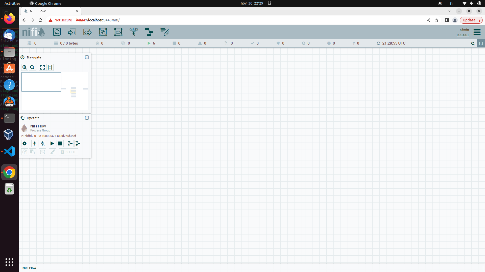

# Flow-based-programming with Apache NiFi

## Install NiFi

Lets install NiFi using a container in order to have the environment set. The image is available on [dockerhub](https://hub.docker.com/r/apache/nifi).

Create the container and mount a volume to the `/data` repository in the conatiner and to the lab directory of this module. **Do not mount it to a not empty folder on your host as you might lose your data in this folder afterwards.**

If docker does not work install NiFi directly on your host using the official [NiFi documentation](https://nifi.apache.org/project-documentation.html).

Once everything set, the UI in your browser should look like this:

## Create a Dataflow

NiFi works with drag and drop. To create a flow you need to:

1. Click on the processor icon on the top right and drop it in the canvas.

2. You chose your processor

3. Click on the processor and enter the settings

4. once you have two processors and want to make a connection between them, pull the arrow from one to the other.

Documentation can be read on the [official NiFi website](https://nifi.apache.org/project-documentation.html).

## Exercice 1

1. Create a flow that takes a file from one folder, renames it and puts it back in the same folder.

2. The same flow but it only changes the extension of the file.

3. The same flow but puts the file in a different folder.

4. for those having AWS it puts the file in an S3 bucket as well as in the local folder.

5. Export the final template.

## Exercice 2

1. Create a NiFi Registry container. The Image can be taken from [dockerhub](https://hub.docker.com/r/apache/nifi-registry).

2. Create a bucket, connect it to NiFi and put the last flow in it using the [NiFi userguide](https://nifi.apache.org/docs/nifi-registry-docs/html/user-guide.html)
