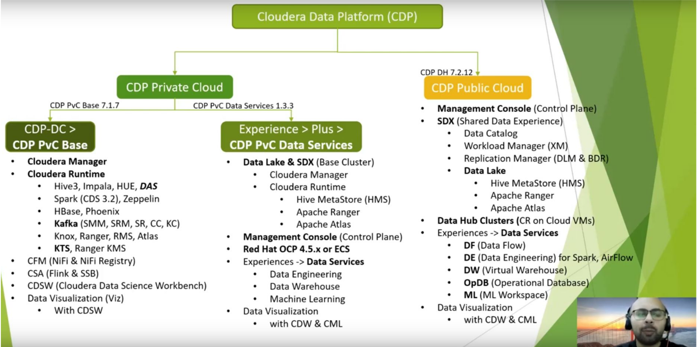
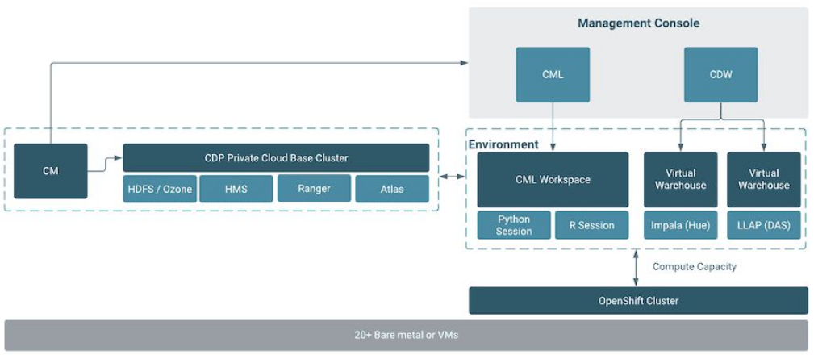
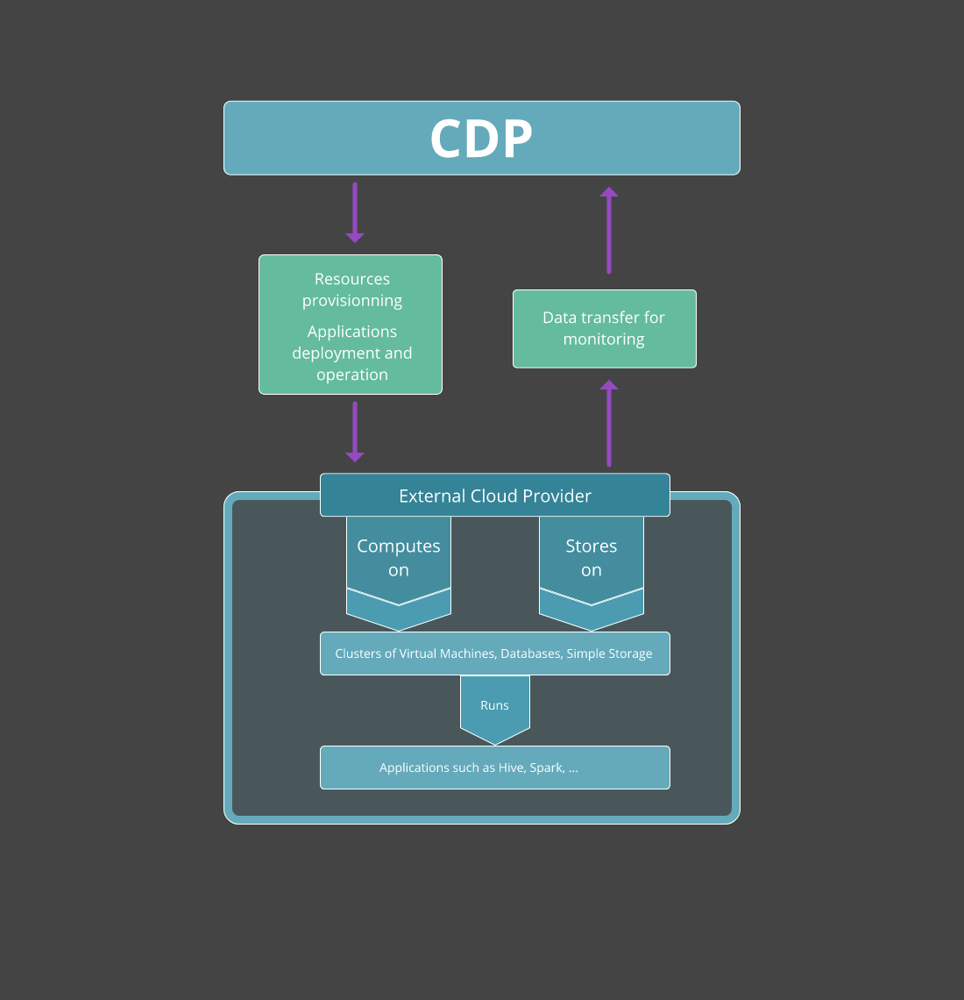
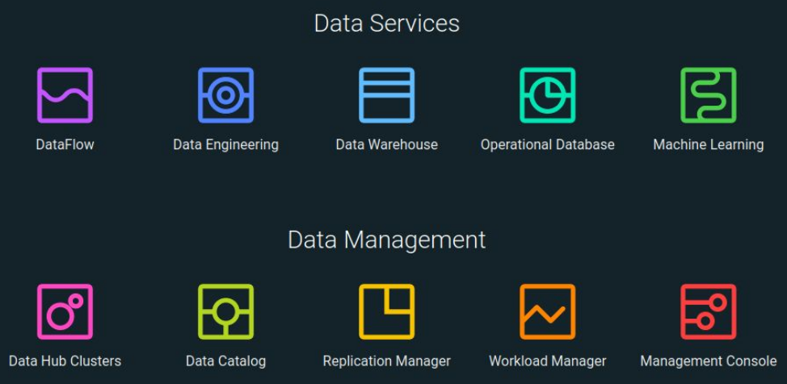
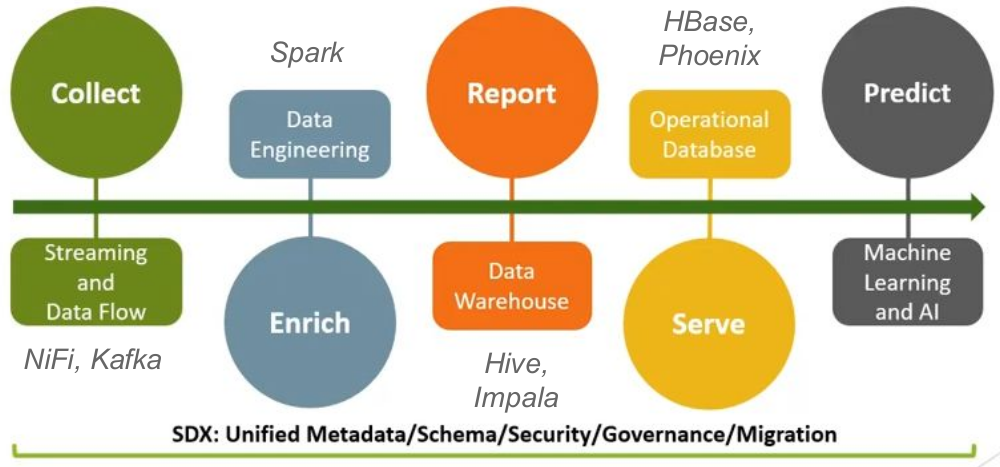

# Cloudera Data Platform

## What is CDP?

- Cloud computing platform for businesses
- Tools to analyze and centralize data
- Security and governance at the corporate level
- Private, public and hybrid cloud

## CDP Private Cloud

- Designed for hybrid cloud deployment
- Computing and storage are decoupled, enabling clusters of these two to scale independently
- The components are much more flexible since the user has more control over the cluster deployment

### Architecture

### Benefits of CDP Private Cloud

- Flexibility — your organization’s cloud environment can be tailored to meet specific business requirements.
- Control — Higher levels of control and privacy due to non-shared resources.
- Scalability — private clouds often provide higher scalability, when compared to on-premises infrastructure.

## CDP Public Cloud

- Platform-as-a-service (PaaS)
- Could be deployed on all three public clouds and transferred among them
- It can automatically scale workloads and resources up and down in order to enhance performance and lower costs

### CDP Public Cloud Architecture

### CDP Public Cloud Services

### DataFlow

- This service is a streaming application that allows users to pull data from various sources and place it in various destinations for staging, like an AWS S3 bucket, while using triggers. 

- The underlying component of this service is Apache NiFi.

### Data Engineering

- This service is the core extract, transform and load (ETL) component of CDP Public Cloud. It performs the automatic orchestration of a pipeline by ingesting and processing data to make it usable for any subsequent use. 

- It takes data from a staging area by the DataFlow service and runs Spark or AirFlow jobs.

### Data Warehouse

- This service allows users to create databases and tables and perform queries on the data using SQL. 

- A warehouse holds data ready for analysis, and the service includes a Data Visualization feature.

### Operational Database

This service creates databases for dynamic data operations and is optimized for online transactional processing (OLTP). This distinguishes it from the Data Warehouse service, which is optimized for online analytical processing (OLAP).

### Machine Learning

CDP Machine Learning is the tool used by data scientists to perform estimations, classifications and other AI-related tasks.

## References

[An overview of Cloudera Data Platform (CDP)](https://www.adaltas.com/en/2021/07/19/cloudera-data-platform-overview/)

[CDP part 1: introduction to end-to-end data lakehouse architecture with CDP](https://www.adaltas.com/en/2023/06/08/cdp-public-cloud-architecture/)

[CDP (Cloudera Data Platform) Understanding](https://www.youtube.com/watch?v=fusdGk0K72I)
