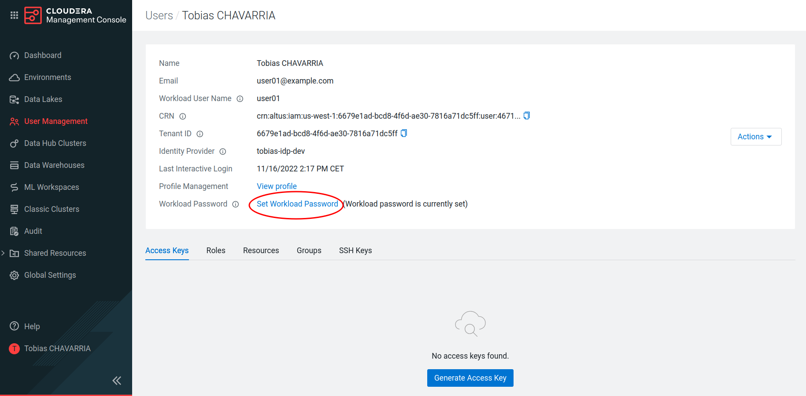
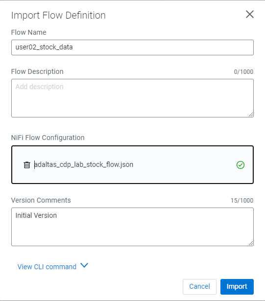
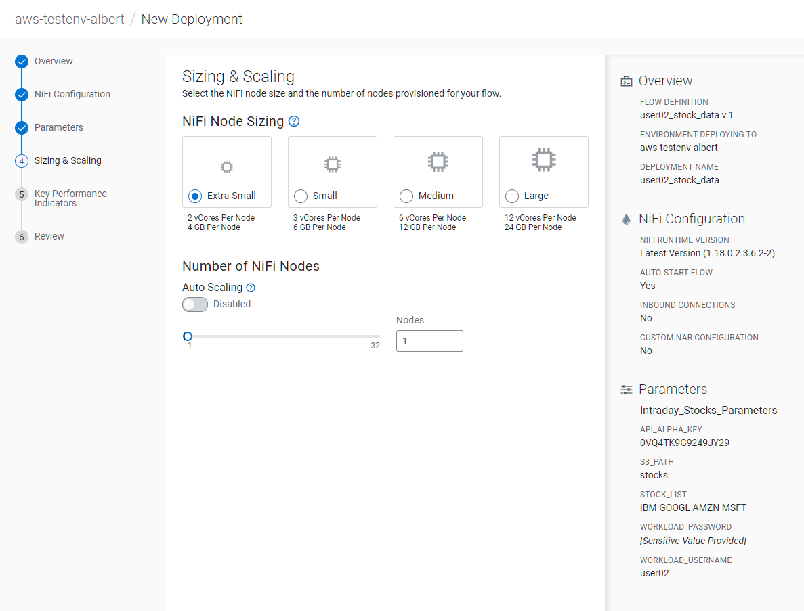
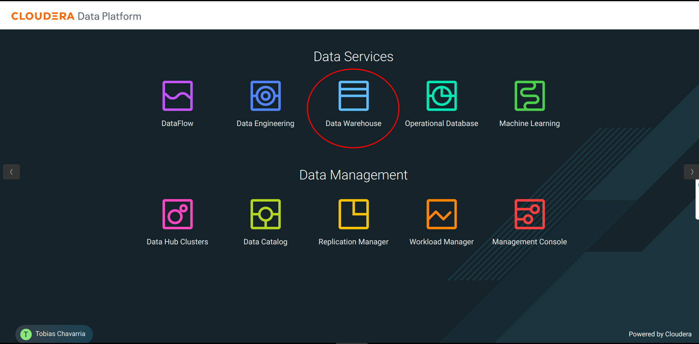
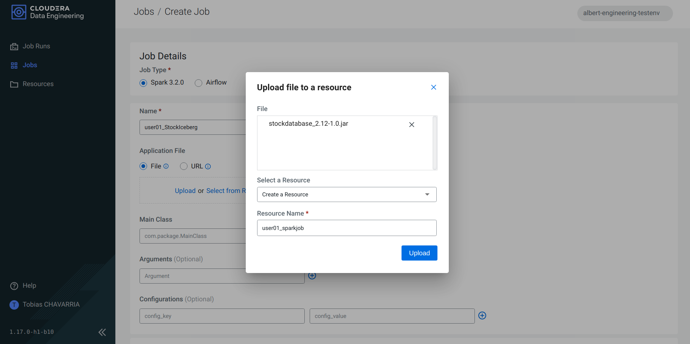

# CDP Public Cloud environment and Iceberg tables

Hands-on lab to use a CDP Public Cloud environment and Iceberg table format to ingest, process, and analyze stock intraday data from a free stock API.

## Step 1: Get Alpha Vantage API Key

1. Navigate to [Alpha Vantage](https://www.alphavantage.co/)

   

2. Click on: **Get Your Free Api Key Today**
3. Fill the information to claim the key:
   1. `Student`
   2. `School/organization` name
   3. Valid email address
4. Click on `GET FREE API KEY`

    

5. Take note of your key (`<api_alpha_key>`) as you will need it later.

## Step 2: Access CDP Public Cloud Portal

1. Please login [here](https://54.75.97.16:8443/auth/realms/tobias-lab-dev/protocol/saml/clients/cdp-sso) with the `<username>` and password provided by the instructor

    

2. You should be able to get to the CDP Console

    

> Note: The first time you login, you will get a message of not secure site, you can accept the risk and continue since there is no sensitive information used.

## Step 3: Set your Workload Password

You need to set the workload password linked to your cdp user (`<username>`), this will allow you to perform tasks using CDP and its services.

1. Click on your name on the button left corner and click on **Profile**

    

2. Click on	**Set Workload Password**

    

3. After succesfully set your workload password you should have this message `("Workload password is currently set")` on your profile.

> Note: You can reset your worload password in case you have lost it.

## Step 4: Import the NiFI flow

In this step you will import the NiFi flow that has been configured to ingest the stock data via API using your *API key* to Object Storage of the CDP environment.

1. Navigate to the CDP portal and select the **DataFlow** icon

    

2. On the left menu click on **Catalog** and then on **Import Flow Definition**

    

3. Import the [NiFi Flow](lab-resources/adaltas_cdp_lab_stock_flow.json) and fill up the parameters as follow:

   - Flow name: `<username>_stock_data`
   - Flow description:
   - Import: [NiFi Flow](lab-resources/adaltas_cdp_lab_stock_flow.json)
   - Click on **Import**

    


## Step 5: Deploy NiFI flow

> Note: In case the previous section is deleted, this needs to be modified

1. Click on the flow definition created in the previous step
2. Click on **Deploy**

    

3. Select `aws-testenv-albert` as *Target Environment*
4. Click on **Continue**

    

5. Set the Deployment Name: `<username>_stock_data`

    

6. Do not modified the **NiFi Configuration** tab, click on **Next**

    

7. **Parameters** tab, set:
   - api_alpha_key: `<api_alpha_key>`
   - s3_path: `stocks`
   - stock_list: `default`
   - workload_password: `<workload_password>`
   - workload_username: `<username>`

    

8. **Sizing & Scaling** tab, set:
   - NiFi Node Sizing: `Extra Small`
   - Auto Scaling: `Disabled`
   - Nodes: `1`

    

9. **Key Performance Indicators**: Click on next
    > Note: KPI’s can be defined in regards what has been specified in the NiFi flow, we will skip this for simplication

    

10. The **Review** tab should look like this, then you click on **Deploy**

    

This last step will launch the NiFi flow, it will take a few minutes until the flow is up and running, you can check the progress on the **Dashboard** tab in the CDF page.

## Step 6: View NiFi Flow

Once the NiFi flow is up and running it is possible check and review the flow.

1. Click on blue arrow on the right of your deployed flow

    

2. Click on **Manage Deployment** top right corner

    

3. **Deployment Manager**: Click on **Actions** and then on **View NiFi**

    

4. This will open another browser tab with the NiFi flow

    

5. Take a few minutes to explore and understand the different components of the flow
6. Suspend the flow, go back to **Deployment Manager**, **Actions**, click on **Suspend flow**

## Step 7: Create Iceberg Table

Now we are going to create the Iceberg table.

From the [CDP Portal](https://console.cdp.cloudera.com/#/)

1. Select Data Warehouse

   

2. Click the **HUE** button on the top right corner, this will open the *HUE Editor*

    

    

3. Create database using your `<username>`

    ```sql
    CREATE DATABASE <username>_stocks;
    ```

    

4. Create an Iceberg table `stock_intraday_1min` on the database created in the previous step:

    ```sql
    CREATE TABLE IF NOT EXISTS <username>_stocks.stock_intraday_1min (
      interv STRING
      , output_size STRING
      , time_zone STRING
      , open DECIMAL(8,4)
      , high DECIMAL(8,4)
      , low DECIMAL(8,4)
      , close DECIMAL(8,4)
      , volume BIGINT)

    PARTITIONED BY (
      ticker STRING
      , last_refreshed string
      , refreshed_at string)

    STORED AS iceberg;
    ```

    

5. Perform a `SELECT` to verify that the required permissions have been set
    > Note: It may take a few seconds

    ```sql
    SELECT * FROM <username>_stocks.stock_intraday_1min;
    ```

    

## Step 8: Process and Ingest Iceberg using CDE

Now we will use Cloudera Data Engineering to:

- Check the files in the object storage (S3 bucket)
- Compare if it is new data, and insert them into the Iceberg table

From the [CDP Portal](https://console.cdp.cloudera.com/#/)

1. Select Data Engineering

    

2. On the Virtual Cluster available click the **View Jobs** button on the top right corner

    

3. Navigate to the **Jobs** tab and click on **Create a Job**

    
    
4. Set the **Job details**:

     - Job type: `Spark 3.2.0`
     - Name: `<username>_StockIceberg`
     - Application File: `Upload`
       - File: [stockdatabase_2.12-1.0.jar](./lab-resources/stockdatabase_2.12-1.0.jar)
       - Select a Resource: `Create a Resource`
       - Resource name: `<username>_sparkjob`
     - Main Class: `com.cloudera.cde.stocks.StockProcessIceberg`
     - Arguments:
       - `<username>_stocks`
       - `s3a://cdp-260785/`
       - `stocks`
       - `<username>`

    

    

5. Click on **Create and Run**

    

6. Navigate to **Jobs** and select the job created above to check the status.

    >Note: It will take around 3-7 min to finish

    

This application will:

- Check new files in the new directory
- Create a temp table in Spark/cache this table and identify duplicated rows (in case that NiFi loaded the same data again)
- `MERGE INTO` the final table, `INSERT` new data or `UPDATE` if exists
- Archive files in the bucket
- After execution, the processed files will be in your bucket but under the `processed-date` directory

## Step 9: Create Dashboard using CDP DataViz

### Create a dataset

1. Go back to the Cloudera Data Warehouse
2. On the left menu choose: **Data Visualization** and click the **Data VIZ** button on the right.

    

3. On the top of the screen click on **DATA**

    

4. On the left select the **dwh-impala-connection** connection

    

5. Click on **NEW DATASET** and set:

   - Dataset title *: `<username>_dataset`
   - Dataset Source: `From Table`
   - Select Database: `<username>_stocks`
   - Select Table: `stocks_intraday_1min`
   - Create

    

### Create a Dashboard

1. Click on **New Dashboard**

    

2. Wait a few seconds until you get the following

    

3. On the **Visuals** tab drag:
    - Dimensions: `ticker`
    - Measure: `volume`
    - `REFRESH VISUAL`
    - Visuals -> `Packed Bubbles`

    

    

4. Save it and make it public
    1.  Enter a title: `<username> Dashboard`
    2. Navigate to the top left corner click on `Save`
    3. Change: `Private` -> `Public`
    4. Click **Move**

    

 ## Step 10: Query Iceberg Tables in Hue and Cloudera Data Visualization

### Iceberg snapshots

Let’s see the Iceberg table history

1. Go back to the **Hue Editor**
2. Execute and take note of the `<snapshot_id>`

    ```sql
    DESCRIBE HISTORY <username>_stocks.stock_intraday_1min;
    ```

    

3. Execute the following Impala query:

    ```sql
    SELECT count(*), ticker
    FROM <username>_stocks.stock_intraday_1min
    FOR SYSTEM_VERSION AS OF <snapshot_id>
    GROUP BY ticker;
    ```

    

### Adding a new stock

1. Go back to the **Deployment Manager** of your NiFi Flow (*See Step 6*)
2. Select **Parameters**

    
3. Add on the parameter `stock_list` the stock **NVDA** (NVIDIA), and click on **Apply Changes**

    > Any stock symbol is valid, check: https://stockanalysis.com/stocks/

    

4. Once the changes are applied, click on **Actions**, **Start flow**

### Run again the Spark Job

1. Go back to the DE Service, tab **Jobs**(*See Step 8*)
2. Click on the 3 dots of your job and click on **Run now**

    

### Check new snapshot history
> Note: New job run must be finished

1. Go back to the **Hue Editor**
2. Check the snap-history again and take note of the new `<snapshot_id>`

    ```sql
    DESCRIBE HISTORY <username>_stocks.stock_intraday_1min;
    ```

3. Check the the new snapshot data
    > Note: As CDF has ingested a new stock value and then CDE has merged those values it has created new Iceberg snapshot

   

4. Execute a `SELECT` using the new `<snapshotid>` to see the new stock data added

    

5. Run this query without snapshot, to get all values, because all parents and child snapshots

    ```sql
    SELECT *
    FROM <username>_stocks.stock_intraday_1min
    ```
1. To check the files in the S3 bucket:

    ```sql
    SHOW FILES IN <username>_stocks.stock_intraday_1min
    ```

    

## Play around with the visuals

Go back to the **Data Visualizations** and explore the different options availables for the dashboard


